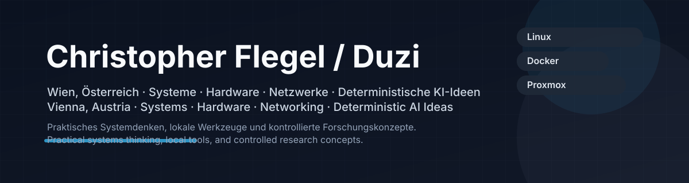
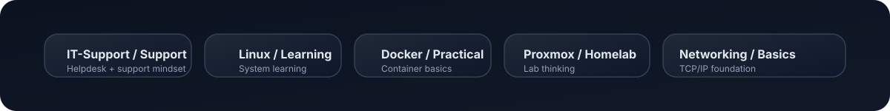
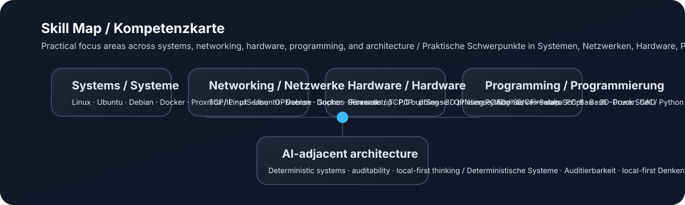
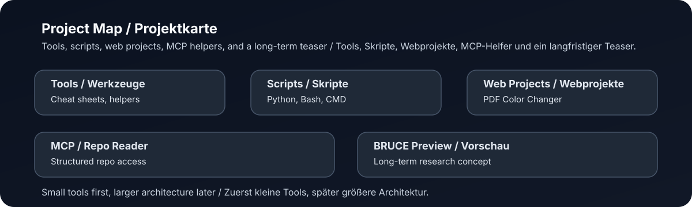
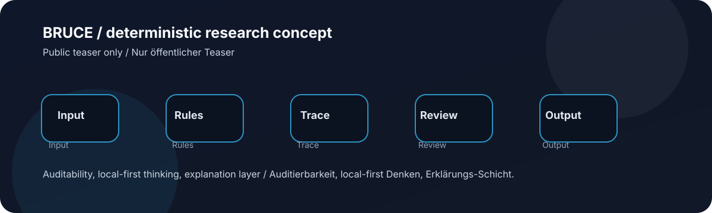
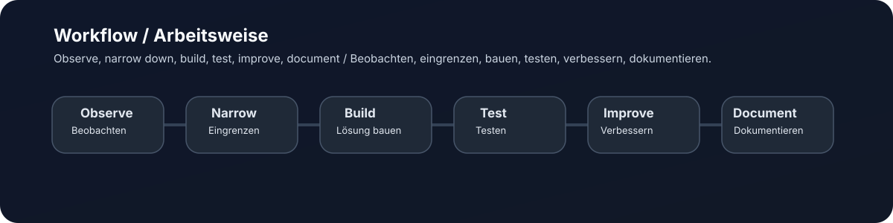

# Christopher Flegel / Duzi

**DE:** Wien, Österreich. Technik, Systeme, Hardware, Netzwerke und eigene Software-Ideen.  
**EN:** Vienna, Austria. Systems, hardware, networking, and self-built software ideas.

  <a href="#about--über-mich">About / Über mich</a> •
  <a href="#skills--kompetenzen">Skills / Kompetenzen</a> •
  <a href="#projects--projekte">Projects / Projekte</a> •
  <a href="#workflow--arbeitsweise">Workflow / Arbeitsweise</a> •
  <a href="#education--ausbildung">Education / Ausbildung</a> •
  <a href="#contact--kontakt">Contact / Kontakt</a>

  

**DE:** Kleine Status-Leiste für einen schnellen technischen Überblick.  
**EN:** Small status strip for a quick technical overview.

## About / Über mich

<strong>DE: Kurzprofil für Recruiter / EN: Short profile for recruiters</strong>

**DE:** Motivierter IT-Einsteiger aus Wien mit praktischem Fokus auf EDV, Linux-Systeme, Hardware, Netzwerke, Docker, Proxmox und technische Problemlösung.  
**EN:** Motivated IT beginner from Vienna with a practical focus on IT, Linux systems, hardware, networking, Docker, Proxmox and technical problem solving.

<strong>DE: Technischer Modus / EN: Technical mode</strong>

**DE:** Ich arbeite gerne praktisch: Systeme aufsetzen, Probleme analysieren, Abläufe testen, Fehler eingrenzen, dokumentieren und Schritt für Schritt verbessern.  
**EN:** I like working practically: setting up systems, analyzing problems, testing workflows, narrowing down errors, documenting and improving things step by step.

### Dashboard / Übersicht

| Bereich / Area | Status / Status | DE | EN |
|---|---:|---|---|
| IT Support | Learning + Practice | EDV und technische Unterstützung | IT and technical support |
| Linux | Practical basics | Arbeiten mit Linux-Systemen | Working with Linux systems |
| Networking | Basics | TCP/IP und Firewalls | TCP/IP and firewalls |
| Hardware | Practical | PC, Server, 3D-Druck | PC, servers, 3D printing |
| Documentation | Active | Notizen, Cheat Sheets, Projektstruktur | Notes, cheat sheets, project structure |

**DE:** Mein Profil ist bewusst praktisch aufgebaut: sehen, verstehen, testen, verbessern.  
**EN:** This profile is intentionally practical: observe, understand, test, improve.

<pre>
duzi@it-workshop:~$ profile scan

status: learning_and_building
focus:  linux | hardware | networking | support | homelab
mode:   practical_problem_solving
goal:   understand -> test -> improve -> document
</pre>

## Skills / Kompetenzen

<strong>Systems & Servers / Systeme & Server</strong>

| DE | EN |
|---|---|
| Linux, Ubuntu/Debian | Linux, Ubuntu/Debian |
| Proxmox VE Grundlagen | Proxmox VE basics |
| Docker Grundlagen | Docker basics |
| Server- und Hardware-Setup | Server and hardware setup |

<strong>Networking & Security / Netzwerk & Sicherheit</strong>

| DE | EN |
|---|---|
| TCP/IP-Grundlagen | TCP/IP basics |
| Firewalls | Firewalls |
| OPNsense, pfSense, Sophos | OPNsense, pfSense, Sophos |
| Netzwerkverständnis | Networking fundamentals |

<strong>Programming / Programmierung</strong>

| DE | EN |
|---|---|
| Python Grundlagen | Python basics |
| C/C++ Grundlagen | C/C++ basics |
| JavaScript Grundlagen | JavaScript basics |
| Bash, CMD, PowerShell | Bash, CMD, PowerShell |

<strong>Hardware & Making / Hardware & Making</strong>

| DE | EN |
|---|---|
| PC-Bau und Hardware | PC building and hardware |
| 3D-Druck Setup und Tests | 3D printing setup and tests |
| TinkerCAD | TinkerCAD |
| FreeCAD im Aufbau | FreeCAD in progress |
| Arduino/ESP32 Grundlagen | Arduino/ESP32 basics |

## Projects / Projekte

<strong>PDF Color Changer Website</strong>

**DE:** Webtool zum Verändern von PDF-Farben für praktische Druck- und Lesbarkeitsanpassungen.  
**EN:** Web tool for changing PDF colors for practical printing and readability adjustments.

| Field / Feld | Value / Wert |
|---|---|
| Stack / Tech | HTML / CSS / JavaScript |
| Status / Status | Active / Aktiv |
| Link / Link | [Repository öffnen / Open repository](https://github.com/ChrisFle2003/PDF-Color-Changer-for-Printer_Website) |

<strong>PDF Color Changer Python</strong>

**DE:** Python-Tool für praktische PDF-Farbänderungen.  
**EN:** Python tool for practical PDF color changes.

| Field / Feld | Value / Wert |
|---|---|
| Stack / Tech | Python |
| Status / Status | Active / Aktiv |
| Link / Link | [Repository öffnen / Open repository](https://github.com/ChrisFle2003/PDF-Color-Changer_Python) |

<strong>MCP_REPO_Reader</strong>

**DE:** Tool zum strukturierten Lesen von Repository-Inhalten.  
**EN:** Tool for structured reading of repository content.

| Field / Feld | Value / Wert |
|---|---|
| Stack / Tech | Python / MCP |
| Status / Status | Active / Aktiv |
| Link / Link | [Repository öffnen / Open repository](https://github.com/ChrisFle2003/MCP_REPO_Reader) |

<strong>Bash / CMD / PowerShell Cheat Sheet</strong>

**DE:** Persönliche Sammlung nützlicher Befehle für Alltag, Lernen und Troubleshooting.  
**EN:** Personal collection of useful commands for daily work, learning and troubleshooting.

| Field / Feld | Value / Wert |
|---|---|
| Stack / Tech | Markdown |
| Status / Status | Maintenance / Pflege |
| Link / Link | [Repository öffnen / Open repository](https://github.com/ChrisFle2003/Bash-CMD-PowerShell-Cheat-Sheet) |

<strong>APP-Killer_v9000</strong>

**DE:** Kleines Hilfsprojekt zum Beenden von Anwendungen.  
**EN:** Small helper project for terminating applications.

| Field / Feld | Value / Wert |
|---|---|
| Stack / Tech | Scripts |
| Status / Status | Experiment / Experiment |
| Link / Link | [Repository öffnen / Open repository](https://github.com/ChrisFle2003/APP-Killer_v9000) |

<strong>BRUCE Vorschau / BRUCE Preview</strong>

**DE:** BRUCE ist meine langfristige Forschungs- und Architekturidee rund um deterministische, KI-nahe Systeme, überprüfbare Entscheidungswege, Wissensstrukturen und effiziente Hardware-Nutzung. Der Fokus liegt nicht auf Black-Box-Magie, sondern auf nachvollziehbaren Schritten, Auditierbarkeit und kontrollierbarer Systemlogik.  
**EN:** BRUCE is my long-term research and architecture idea around deterministic, AI-adjacent systems, traceable decision paths, knowledge structures, and efficient hardware usage. The focus is not black-box magic, but understandable steps, auditability, and controllable system logic.

**DE:** Öffentliche Konzepte: deterministische Architektur, Wissenssysteme, Auditierbarkeit, Hardware-Effizienz, local-first Denken und LLMs als Erklärungs-Schicht statt als unkontrollierte Autorität.  
**EN:** Public concepts: deterministic architecture, knowledge systems, auditability, hardware efficiency, local-first thinking, and LLMs as an explanation layer instead of an uncontrolled authority.

| Field / Feld | Value / Wert |
|---|---|
| Status / Status | Long-term / Langfristig |
| Visibility / Sichtbarkeit | Public teaser only / Nur öffentlicher Teaser |
| Link / Link | No public repo yet / Noch kein öffentliches Repo |

## Workflow / Arbeitsweise

<strong>DE: Wie ich technische Probleme angehe / EN: How I approach technical problems</strong>

| Schritt / Step | DE | EN |
|---|---|---|
| 1 | Problem beobachten | Observe the problem |
| 2 | Ursache eingrenzen | Narrow down the cause |
| 3 | Lösungsidee bauen | Build a solution idea |
| 4 | Testen | Test it |
| 5 | Verbessern | Improve it |
| 6 | Dokumentieren | Document it |

## Education / Ausbildung

<strong>Education / Ausbildung</strong>

| Zeitraum / Period | DE | EN |
|---|---|---|
| 05/2024 | IP/TCP Weiterbildung | TCP/IP training |
| 09/2022 - 06/2023 | BFI IT-Schule Wien | BFI IT School Vienna |
| 03/2022 | WIFI Wien, C++ Grundlagen | C++ basics, WIFI Vienna |
| 09/2020 - 01/2022 | HTL Bautechnik | Technical college for construction engineering |
| 09/2014 - 06/2018 | NMS IT | Secondary school with IT focus |

<strong>Work Experience / Berufserfahrung</strong>

| Zeitraum / Period | Rolle / Role | DE | EN |
|---|---|---|---|
| 10/2025 - 11/2025 | Praktikum / Internship | Einblick in technische und organisatorische Abläufe. | Insight into technical and organizational workflows. |
| 12/2024 - 06/2025 | Frühschicht Aushilfe / Early shift assistant | Zuverlässige Frühschichtarbeit und Unterstützung im Filialbetrieb. | Reliable early shift work and support in store operations. |
| 12/2023 - 06/2024 | Tele-Tec Telekommunikation | Praktische Tätigkeit im Telekommunikationsumfeld. | Practical work in a telecommunications environment. |

## Interests / Interessen

| DE | EN |
|---|---|
| Eigene Projekte, Ideen und Konzepte entwickeln | Developing own projects, ideas, and concepts |
| Kochen & Grillen | Cooking & grilling |
| Musik hören | Listening to music |
| Technik, Hardware, Systeme | Technology, hardware, systems |
| 3D-Druck / CAD / Making | 3D printing / CAD / making |

## Contact / Kontakt

**DE:** Für technische Kontakte ist mein GitHub-Profil der wichtigste öffentliche Einstiegspunkt.  
**EN:** For technical contact, my GitHub profile is the main public entry point.

- [ChrisFle2003 auf GitHub / ChrisFle2003 on GitHub](https://github.com/ChrisFle2003)

## Abschluss-Zitat / Closing Quote

> **DE:** „Wissen ist Gold wert — achtsame, behutsame Bewegung macht daraus Fortschritt.“  
> **EN:** “Knowledge is worth gold — careful, mindful movement turns it into progress.”
